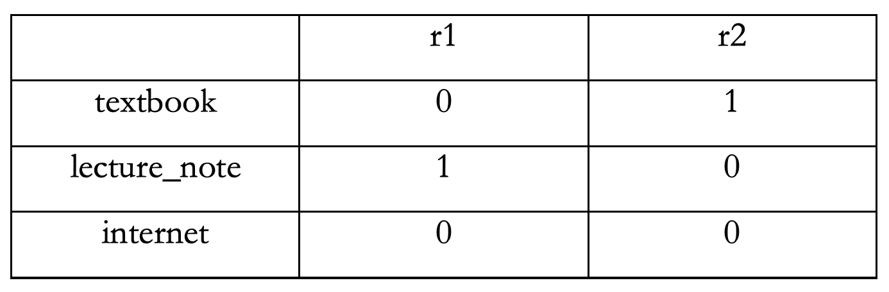

<h2>1 Preparing data</h2><br>

<h4>1.1 Introduction</h4><br>
<p>The problem to be solved in this study is to determine whether the gpa can somehow be predicted with certain predictors. Sample data of 61 observations from students is collected: hours of studying on each day(study_hour), type of resource they use the most when studying(resource_type), an average number of times they see TA during a week(freq_TA), hours of sleep on each day(sleep_hour), and whether they are currently in a relationship with other person(relationship). Note that the src_type is categorized into 3 types of textbook, lecture_note and internet. This data is collected completely randomly and independently from the survey using free google survey form. Although the size of the sample data is small to build the most accurate model, we will still be building a model and kind of get the idea of what model parameters are useful for a prediction of y and what are not.</p><br>

<h4>1.1 Load necessary libraries and data</h4>
```{r setup, include=FALSE}
library(tidyverse)
library(tidyr)

tab <- read.csv("./gpa_dat.csv")
```

<b><i>Attributes:</i></b><br>
<ui>
  <li><b>time_stamp</b>: Column to be removed</li>
  <li><b>email</b>: Column to be removed</li>
  <li><b>study_hour</b>: Hours of study each day(continuous)</li>
  <li><b>resource_type</b>: Type of resource students use the most when studying(textbook, leture_note, internet)(categorical)</li>
  <li><b>freq_TA</b>: Average number of times students visit TA during a week(continuous)</li>
  <li><b>sleep_hour</b>: Hours of sleep each day(continous)</li>
  <li><b>relationship</b>: Whether students are in a relationship with others(continous)<br></li>
</ui>
<br>

<h4>1.2 Missing values</h4><br>
<p>Properly informed with missing data is very significant, because they indicate how much we do not know about the data set. Additionally, many models can break down when missing values are involved, so certain rows with missing data should be either removed or values need to be estimated with appropriate method.</p><br>
```{r}
sum(is.na(tab))
```
<p>Fortunately, there were no missing values in the data set.</p><br>

<h4>1.3 Reformating dataset</h4><br>
<p>Tidying the data set is necesary for a better data exploring.</p><br>
```{r}
tidy_tab <- tab %>%
  # filtering gpa less than 4.0
  filter(gpa <= 4.0) %>% 
  # dropping unnecessary columns
  select(-time_stamp,  -email) %>% 
  # making two dummy variables for resource_type using fastDummies package
  fastDummies::dummy_cols(remove_first_dummy = TRUE) %>% 
  select(-resource_type)

names(tidy_tab)[6] <- "r1"
names(tidy_tab)[7] <- "r2"

```
<p>Above code includes reading a csv data file and some data wrangling. The raw data was initially checked for any missing data or any incorrect data, but there were none, so a code to clean up the data set was omitted. However, since the scale of gpa is from 0.0 to 4.0, observations that contains incorrect gpa value needed to be filtered. As stated before, in the introduction, since there are 3 types of resource_type, it needs 3-1=2 number of dummy variables for the model parameters, which are r1 and r2.</p>



<h4>1.4 Visual plots of variables</h4><br>
<h6> Gpa by study_hour and sleep_hour </h6><br>
```{r}
tidy_tab %>% 
  ggplot(aes(x=study_hour, y=gpa)) +
  geom_point(color = "orange") +
  geom_smooth(method = lm) +
  labs(title = "GPA by study hour",
       x = "Study hour",
       y = "GPA") +
  scale_x_continuous(breaks = seq(0, 10, 2))

tidy_tab %>% 
  ggplot(aes(x=sleep_hour, y=gpa)) +
  geom_point(color = "deepskyblue3") +
  geom_smooth(method = lm) +
  labs(title = "GPA by sleep hoour",
       x = "Sleep hour",
       y = "GPA") +
  scale_x_continuous(breaks = seq(0, 10, 1))
```
<p>It seems there is some linear relationship between GPA and sleep_hour and study_hour with some outliers. Removing those weird values will definitely increase the accuracy of the model.</p><br>

```{r}
# removing weird values
useless_rows1 <- which(tidy_tab$study_hour >= 4 & tidy_tab$gpa <= 2.0)
useless_rows2 <- which(tidy_tab$sleep_hour >= 6.5 & tidy_tab$gpa <= 2.5)

# there are some overlaying data, so you must use union function in order not to remove any other data
useless_rows <- union(useless_rows1, useless_rows2)

new_tidy_tab <- tidy_tab[-useless_rows,]
```
<p>We cleaned up the data by dropping certain useless rows.</p><br>
```{r}
# checking the plot again
 new_tidy_tab %>% 
  ggplot(aes(x=study_hour, y=gpa)) +
  geom_point(color = "orange") +
  geom_smooth(method = lm) +
  labs(title = "GPA by study hour",
       x = "Study hour",
       y = "GPA") +
  scale_x_continuous(breaks = seq(0, 10, 2))

new_tidy_tab %>% 
  ggplot(aes(x=sleep_hour, y=gpa)) +
  geom_point(color = "deepskyblue3") +
  geom_smooth(method = lm) +
  labs(title = "GPA by sleep hoour",
       x = "Sleep hour",
       y = "GPA") +
  scale_x_continuous(breaks = seq(0, 10, 1))
```
<p>Plots are much better now!!</p><br>

<h4>1.5 Data scaling</h4><br>
<p>Before we start working on building a model, since there are several data that have different scales, we will standardize the data for better accuracy.</p><br>
```{r}
# Could not find the better way to standardize attributes
std_tab <- new_tidy_tab %>% 
  mutate(mean_study_hour = mean(study_hour)) %>% 
  mutate(sd_study_hour = sd(study_hour)) %>%
  mutate(mean_freq_TA = mean(freq_TA)) %>% 
  mutate(sd_freq_TA = sd(freq_TA)) %>% 
  mutate(mean_sleep_hour = mean(sleep_hour)) %>% 
  mutate(sd_sleep_hour = sd(sleep_hour)) %>% 
  mutate(mean_gpa = mean(gpa)) %>% 
  mutate(sd_gpa = sd(gpa)) %>% 
  mutate(std_study_hour = (study_hour - mean_study_hour) / sd_study_hour) %>% 
  mutate(std_freq_TA = (freq_TA - mean_freq_TA) / sd_freq_TA) %>% 
  mutate(std_sleep_hour = (sleep_hour - mean_sleep_hour) / sd_sleep_hour) %>% 
  mutate(std_gpa = (gpa - mean_gpa) / sd_gpa) %>% 
  select(std_gpa, std_study_hour, r1, r2, std_freq_TA, std_sleep_hour, relationship)

names(std_tab)[1] <- "gpa"
names(std_tab)[2] <- "study_hour"
names(std_tab)[5] <- "freq_TA"
names(std_tab)[6] <- "sleep_hour"

```

<p>We will now use the std_gpa data set instead of new_tidy_tab for building a model.</p><br>

<h2>2 Analysis</h2><br>

<h4>2.1 Correlation between predictors</h4><br>

```{r}
library("PerformanceAnalytics")
chart.Correlation(std_tab, histogram = TRUE)
```
<p><strong>Each significance level is associated to symbol</strong></p>
<b><i>p-values</i></b><br>
<ui>
  <li><b>0.001</b> <=> <b>***</b></li>
  <li><b>0.01</b> <=> <b>**</b></li>
  <li><b>0.05</b> <=> <b>*</b></li>
  <li><b>0.1</b> <=> <b>.</b></li>
</ui>
<br>

<p>This matrix form of correlation plot helps you to visualize the association between variables. For instance, if you see the second cell from the top, where the x value is study_hour(column) and y value is gpa(row), it says 0.63 with three red stars. This means that study_hour and gpa are correlated by 63% and it is significant. If you see the box on the second row in the first column, it seems there is a linear relationship between the two, but not strong. If you see the scatter plot on the second column, 5th row, it seems there is no patter between the two variables(x=freq_TA, y=study_hour). The points are scattered all over the place. Additionally, if you see the one on the first row, 6th row, there exists a another linear relationship between the sleep_hour and the gpa with 75% correlation, somewhat strong. This scatter plot can be checked by looking at the first column, 6th row. Just like these examples, association between all the variables can be checked visually. Let’s actually go see more accurate numerical values correlation between the variables.</p>
```{r}
mat <- cor(std_tab)
mat
```
<p>This table shows more accurate correlation numerically between variables. Like we saw in the above example, the correlation between study_hour and gpa was 0.63. Here, it says 0.6318967(more accurate).The table contains the correlation coefficients and test results. Notice that the correlation in the main diagonal are all equal to 1. This is because a variable is always perfectly correlated with itself. However, we cannot identify p-values in this table.</p><br>

<h4>2.2 Building a multiple regression model</h4><br>
<p>Now, we saw the correlation between the variables and its significance, let’s plunge into building a multivariate linear regression model using this data sample. The model that we are looking for will be,</p><br>

<center>
<h6>$\hat{y}$  =  $b_{0}$ + $b_{1}$ \* study_hour + $b_{2}$ \* r1 + $b_{3}$ \* r2 + $b_{4}$ \* freq_TA + $b_{5}$ \* sleep_hour + $b_{6}$ \* relationship</h6><br>
</center>

```{r}
model1 <- lm(gpa ~ study_hour + r1 + r2 + freq_TA + sleep_hour + relationship, data = std_tab)
summary(model1)
```
<p>The first thing we can pull from the above is the individual parameter estimates. If you want to use all of the parameter estimates for the model, the model will be the following.

<center>
<h6>$\hat{y}$  =  0.174836 + (0.332914) \* study_hour + (-0.230984) \* r1 + (-0.383016) \* r2 + (0.002749) \* freq_TA + (0.563214) \* sleep_hour + (-0.0.007222) \* relationship</h6><br>
</center>

<p>The value of Adj R-sq is 0.6084, which is ok in this case. This means 60.85% of y-value can be predicted from study_hour, r1, r2, freq_TA, sleep_hour and relationship predictors. The reason why we want to focus on Adj R-Sq instead of R-Square is that each of the predictors comes with the cost of degree of freedom, not counting intercept. You can see that the df value of the whole model above is 6, which implies all the predictors. Let’s say we add a 7 th predictor. Then the R-sq value will probably go up, but that does not take into the account that we are adding another degree of freedom. That will adjust our model if we add extra predictor, degrees of freedom 7, and the AdjRsq will yield a result by taking 7 th degree of freedom into account.</p><br>
<p>Now we are ready to analyze the overall f-test. Null hypothesis and the alternative hypothesis will be the following.</p><br>

<center>
<p>$H_{0}$: $b_{1}$ = $b_{2}$ = $b_{3}$ = $b_{4}$ = $b_{5}$ = $b_{6}$ = 0</p> 
<p>$H_{a}$: At least one of $b_{1}$, $b_{2}$, $b_{3}$, $b_{4}$, $b_{5}$ and $b_{6}$ is not 0.</p> 
<p>(At least one of them is useful in predicting y, but we don’t necessarily know which one is)</p><br>
</center>

<p>Assuming alpha is 0.05, we can see that the p-value is less alpha from the table above. We can go ahead and reject the null hypothesis. We can conclude that the alternative hypothesis is correct, and at least one of $b_{1}$, $b_{2}$, $b_{3}$, $b_{4}$, $b_{5}$ and $b_{6}$ is useful in predicting y.</p><br>

<p>Now we know at least one of these betas is useful, let’s go back to the results and talk about the individual t-test. If we look into the p-value of study_hour, which is 0.01447, it is less than the alpha. We could say that given everything else(every other betas) included in this model, study_hour is still useful, or the $b_{1}$ should be included in the model. We can interpret the result of other betas in the same way. For instance, since p-value of freq_TA is larger than the alpha, we could say that we fail to reject the null hypothesis of $b_{4}$ = 0. Freq_TA or $b_{4}$ is not useful in predicting y, given everything else is included in the model.</p><br>

<p>From the result above, we know that only study_hour and sleep_hour are useful in predicting y, we are going to conduct a partial f-test omitting these predictors.</p><br>

<p>The Null hypothesis and alternative hypothesis will be the following.</p><br>

<center>
<p>$H_{0}$: $b_{2}$ = $b_{3}$ = $b_{4}$ = $b_{6}$ = 0</p> 
<p>$H_{a}$: At least one of $b_{2}$, $b_{3}$, $b_{4}$ and $b_{6}$ is not 0.</p> 
<p>(At least one of them is useful in predicting y, but we don’t necessarily know which one is)</p><br>
</center>

```{r}
test <- lm(gpa ~ r1 + r2 + freq_TA + relationship, data = std_tab)
summary(test)
```

<p>Assuming the alpha is still 0.05, the p-value is larger than the alpha, so we will fail to reject the null hypothesis. This means that we can say that b2, b3, b4 and b6 are equal to 0. So, the ultimate model that we can actually end up using for the data is just the equation with b2, b3, b4 and b6 omitted.</p><br>

<p>Let's compare these two model with anova test.</p><br>

<center>
<p>$H_{0}$: Models do not significantly differ</p> 
<p>$H_{a}$: Model 1(with all predictors) is significantly better</p><br>
</center>

```{r}
model2 <- lm(gpa ~ study_hour + sleep_hour, data = std_tab)
anova(model2, model1)
```
<p>Based on the p-value of 0.5576, we fail to reject the null hypothesis and conclude that we do not have evidence to believe that the model1 is significantly better. We can decide that it is not necessary to include any other predictors except study_hour and sleep_hour.</p><br>


<center>
<h6>$\hat{y}$  =  $b_{0}$ + $b_{1}$ \* study_hour + $b_{5}$ \* sleep_hour</h6><br>
</center>

<p>We can use the model above for estimating as our estimator regression line.</p><br>

<h4>2.3 Assumptions for linear regression</h4><br>
<p>Before we wrap up with the result, we need to check whether the assumptions and conditions for multiple linear regression are satisfied or not. Since the value we are predicting is gpa, which is a continuous value, there is nothing wrong with using linear regression method. Additionally, the data we are modeling meets “iid” condition, which means the error(residual) terms are independent from one another and identically distributed. Let’s take a look at the plots blow.</p><br>

```{r}
# select our data of interest
new_tab <- std_tab %>% 
  select(gpa, study_hour, sleep_hour) 

# obtain predicted and residual values using model2 above
new_tab$predicted <- predict(model2)
new_tab$residuals <- residuals(model2)

# plotting residual
new_tab %>% 
  ggplot(aes(x=predicted, y=residuals)) +
  geom_point(size = 2, color = "orange") +
  geom_hline(yintercept = 0, color = "deepskyblue3", type = "dashed") +
  scale_x_continuous(breaks = seq(-3, 3, 0.5)) +
  scale_y_continuous(breaks = seq(-3, 3, 0.5))

model2.stdres <- rstandard(model2)
qqnorm(model2.stdres,
       ylab = "Residuals",
       xlab = "Normal scores")
qqline(model2.stdres)

```

<p>If we see the bottom Normal Q-Q plot, the residual seems normally distributed with a mean 0, which meets the assumption for linear regression. Additionally, if we take a look at the top scatter plot of residual with respect to predicted value, it is forming a cloud pattern, which seems to be perfectly fine.</p><br>

<h4>2.4 Limitation of the study</h4><br>
<p>Although, I could have done a study with existing dataset, but I wanted to some research on my own using my own data that I collected, however this had a tradeoff. Eventually, the model looks fine, but there are some critical limitations of the study. First of all, the sample size was too small. I had some difficulty in collecting data from students, because not all students answered honestly and carefully. I had to clean up this small dataset, and this made the data set even smaller. Furthermore, the pool of the dataset is only from students who are currently attending Maryland University who are majoring in Computer Science. This is also a huge limitation, because the results may vary depending on the universities and the majors.</p><br>
